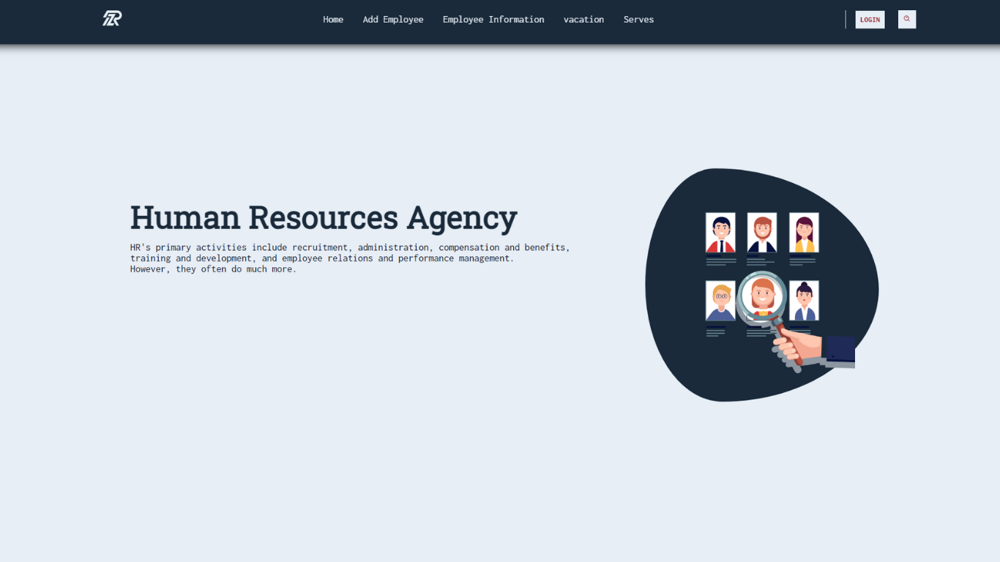

# Human Resources Agency

Welcome to the Human Resources Agency project! This project aims to provide a comprehensive solution for managing human resources in an organization. Whether you are an HR professional or an organization looking to streamline your HR processes, this system offers a range of features to help you manage employee data, recruitment, and other HR-related tasks.

 Visit site : https://mohammed-6726.github.io/Human_Resources_Agency/ 
 

## Features

- Employee Management: Keep track of employee information, including personal details, contact information, and job-related details.
- Recruitment: Manage the entire recruitment process, from creating job listings to tracking applicants and conducting interviews.
- Attendance Tracking: Monitor employee attendance and generate reports to track punctuality.
- Leave Management: Allow employees to request leave and manage leave approvals.
- Performance Evaluation: Conduct performance reviews and track employee performance over time.
- Reports: Generate various reports to analyze HR data and make informed decisions.
- User Authentication: Secure the system with user authentication and authorization.

## Some of The project requirements :
1. User can add a new employee to the system. Employee data should include id,
name, email, address, phone number, gender, marital status, number of available
vacation days, number of actual approved vacation days, salary, date of birth.
2. User can update an existing employee data.
3. User can delete an existing employee data through a delete button in edit
employee data page with a confirmation dialogue for the action before deletion
occurs.
4. User can search for an employee by name in a search for an employee screen
and employees with similar names should be rendered as a table
5. User can select a specific employee after searching to submit a vacation form for
the same employee. The vacation form includes from date, to date, reason,
status which will hold a value =”submitted” and chosen employee id
6. User can review all “submitted” vacations of different employees with the ability to
approve or reject the vacation submitted. Rejection and approval should be done
by two buttons listed beside each submitted employee vacation.

7. If user clicked on approve button, mark vacation as approved , increment
employee actual number of vacation days, decrement available number of
vacation days for that employee and remove vacation from submitted vacations
page
If user clicked on reject button, mark vacation as rejected and remove vacation
from submitted vacations page
8. Website should have a well designed navigation bar to go through all pages and
a home page.

## Getting Started

### Prerequisites

Make sure you have the following software installed before setting up the project:

### Installation

1. Clone the repository:

   ```bash
   git clone https://github.com/Mohammed-6726/Human_Resources_Agency.git
   
Navigate to the project directory:

   ```bash
   cd Human_Resources_Agency
   ```
   ```bash
   .code
   ```

